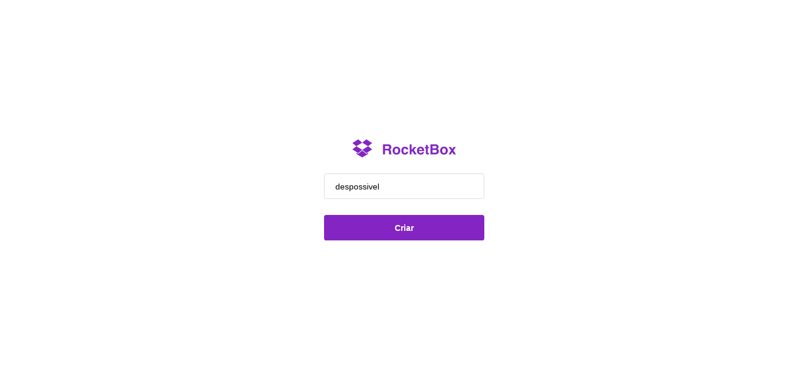
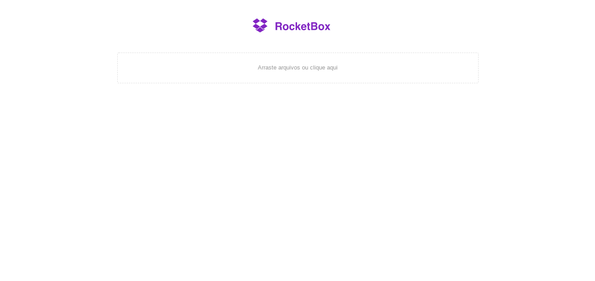

Este projeto foi iniciado com [Create React App](https://github.com/facebook/create-react-app).

## Available Scripts

No diretório do projeto, você pode executar:

### `npm start`
 
Para inciar o projeto

### `npm run build`

Cria o aplicativo para produção na pasta `build`.  
Ele agrupa corretamente o React no modo de produção e otimiza a construção para obter o melhor desempenho.

## Rotas

Este projeto é composto de duas rotas

/

/box/:id

Com o objetivo efetuar o upload de arquivos para o servidor e tem como dependencia um [back-end](https://github.com/despossivel/upload-back-end)

